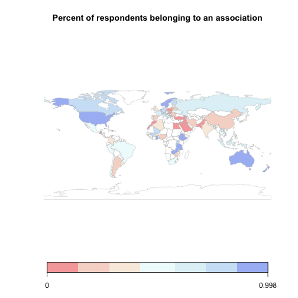

## The question

Civic participation is seen as a cornerstone of democracy in fields of political science, sociology, and education. One way to measure civic participation is looking at the degree to which an individual participates in organizations outside of family and work. Such organizations or associations are often the foundation to social capital and network. 

This app presents data from a question from the World Values Survey (one of the oldest cross-national social surveys in the world) that asks: Are you a member of the following association: sports, arts, labor, politics, environment, women's rights, human rights, charity, or other.

The analyses examine the data by gender and education attainment breakdown as those two criteria are relevant characteristcs to civic participation.

---

## The App

The app gives graphical and tabular representations of the data to faciliate data exploration.
It provides the descriptive analyses of associational membership on geagraphy, gender, and education attainment. 

The app gives regional averages by categories, such as this:

 

--- 
## The App (continued)
The app also gives country-specific data on gender and education attainment, such as:

 

---

## Final words

This app gives a comprehenisve overview of the World Values Survey data and allows you to explore
with regional and country as units of analyses and making comparisons.

Check out the app at <https://peggyfan.shinyapps.io/shinyapps/>

