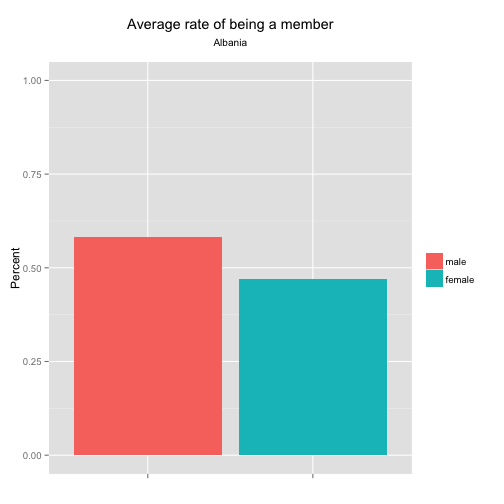

## Background
This app presents data from a question from the World Values Survey (one of the oldest cross-national social surveys in the world) that asks: Are you a member of the following association: sports, arts, labor, politics, environment, women's rights, human rights, charity, or other.

Looking at the degree to which an individual participates in organizations outside of family and work has been one measure of civic participation in the literature.

The App aims to contribute to the study of civic participation. It provides some exploratory analyses and examines the data by gender and education attainment.

---

## The App

The app gives graphical and tabular representations of the data to faciliate exploration. It shows the geographical distribution of associational membership.

 

--- &twocol

## The App (continued)
The app gives regional averages by categories and also country-specific data on gender and education attainment, such as:

*** =left

 

*** =right

 

---

## Final words

This app gives a comprehenisve overview of the World Values Survey data and allows you to explore
with regional and country as units of analyses and making comparisons.

Check out the app at <https://peggyfan.shinyapps.io/shinyapps/>

